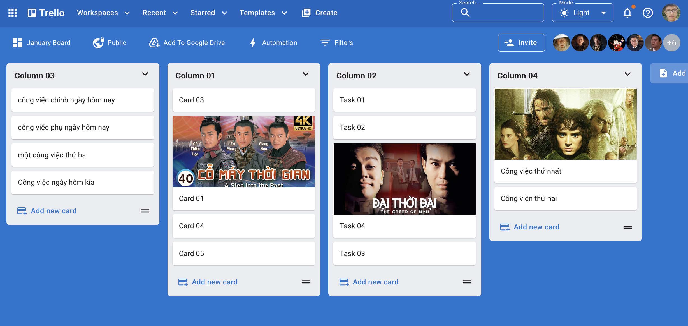
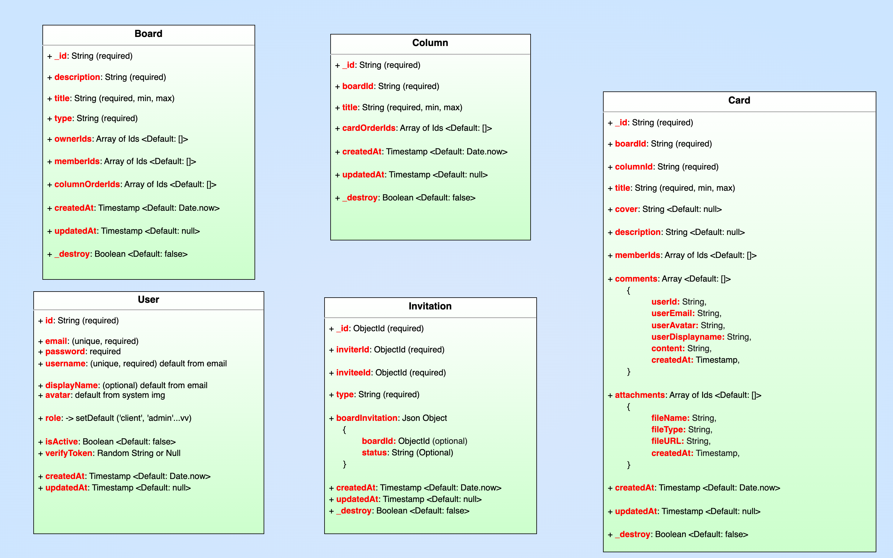

# Trello - MERN stack kanba style Work management web application

Trello is a web-based, kanban-style, list-making application.

Users can create task boards with different columns and move the tasks between them. Typically columns include task statuses such as To Do, In Progress, Done. The tool can be used for personal and business purposes including real estate management, software project management, school bulletin boards, lesson planning, accounting, web design, gaming, and law office case management.

<!-- ## Demo -->

<!-- [Deployment link](https://trello-web-sage-psi.vercel.app/) (Please wait a few seconds for the data to load correctly) -->

<!-- [video demo](youtube.com) -->

[back-end github repo](https://github.com/tgoldenphoenix/trello-clone-api)

## Application Requirements 👀

Open to read

 

👉 Users can create new account using their email

👉 Users must verify their email by clicking a verification link sent to their inbox

👉 Users can create new column and add cards to those column

👉 Users can change columns' order by drag and drop

👉 Users can drag and drop cards in the same column

👉 Users can also drag and drop card to other columns in the same board

👍 App needs Dark Mode and user can set light or dark mode based on computer preference.

## Technologies

### Main technologies

- **Front-end**: ReactJS, Material UI, Redux, [DND kit library](https://dndkit.com/)
- **Back-end**: RESTful API built with NodeJS (Express Framework), [Resend](https://resend.com/about) EaaS, JSON Web Token Authorization & Authentication (stored in HttpOnly Cookie)
- **Database**: MongoDB Atlas
- **Built tools**: Vite, ESLint, Yarn, Babel, Node Version Manager

### Secondary technologies

- **Front-end**: [Redux persist](https://www.npmjs.com/package/redux-persist), React-toastify, Axios (custom interceptors), cross-env, React-router-dom (protected routes), React-hook-form
- **Back-end**: cors, [Joi](https://www.npmjs.com/package/joi) schema description language

## What I gained from building this project 😎

 

Open to read

 

🔵 I try to apply all my knowledge into this project and follow best practices for clean coding.

🔵 Manage sensitive environment variables such as API keys using [dotenv](https://www.npmjs.com/package/dotenv) & [cross-env](https://www.npmjs.com/package/cross-env). All sensitive data are stored in a single file `.env` which must NOT be pushed to Github.

🔵 Token-based Authentication & Authorization with JWT

The access token & refresh token is stored as [HttpOnly cookie](https://developer.mozilla.org/en-US/docs/Web/HTTP/Reference/Headers/Set-Cookie#httponly) which forbids JavaScript from accessing the cookie. The cookie will be send with HTTP request to the server

🔵 Writing custom [Axios interceptors](https://github.com/tgoldenphoenix/trello-clone-web/blob/main/src/utils/authorizeAxios.js)

- Prevent spam-clicking in form submit buttons.
- Handle all responses' error status code & message in one place (clean code)

🔵 Front-end routing

Using `ProtectedRoute`, if user not log in => always re-direct to `/login` page

🔵 Back-end routing:

Route, Middleware, Validation, Controller, Service, Model

🔵 Project file structure follows best practice which makes it easy to read, maintain and keeping each source codes file modular and reusable.

- Front-end ReactJS: pages, components, redux, apis, assets, customLibraries
- Back-end Express: routes, middlewares, controllers, services, models, config, utils, etc...

🔵 Front-end form validation with regex and **react-hook-form**. Back-end data validation with [joi](https://www.npmjs.com/package/joi)

🔵 Managing Front-end states in application with **Redux**:

Using [Redux persist](https://www.npmjs.com/package/redux-persist) to store user slice into local storage. When user reload page, the user slice is not erased.

🔵 Give users a way to toggle between light modes, dark mode and system preference by using Material UI `useColorScheme` hook. Also stored user's preference in local storage.

🔵 Write highly reusable **React Functional Components**, with custom styling by leveraging Material UI `styled-component`

Examples: Reusable AppBar Component, FieldErrorAlert Component, and ModeSelect Component with custom styling

🔵 Professional large frontend application planning:

- From gather business requirements, frontend architecture, thinking about the data flow through the entire application
- and then Break the application into categories of features.
- Choosing suitable Technology Stack for high quality frontend development.

🔵 This application is built with **Performance and Maintainability** in mind.

## Database schema

 

Open to read

 

